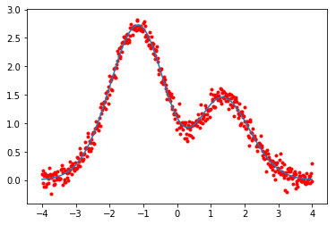

### 1. BP神经网络

#### 1.1 感知器

神经网络是由具有适应性的简单单元组成的广泛并行互连的网络，它的组织能够模拟生物神经系统对真实世界物体所作出的交互反应" 。

神经网络中最基本的成分是神经元(neuron)模型，即上述定义中的" 简单单元"。在生物神经网络中，每个神经元与其他神经元相连，当它"兴奋"时，就会向相连的神经元发送化学物质，从而改变这些神经元内的电位;如果某神经元的电位超过了一个"阈值" (threshold) ， 那么它就会被激活，即"兴奋"起来，向其他神经元发送化学物质。一种自然的修正方式就是通过一个阈值函数输出，即将输出表示为：
$$
g_{P}\left(x_{i}, w\right)=\left\{\begin{array}{ll}{1,} & {\text { if } w^{T} x_{i}>0} \\ {0,} & {\text { otherwise }}\end{array}\right.
$$


<center><font face="楷体" size=3><strong>图1-1 线性回归的前馈网络示意图</strong></font></center>

简便起见，阈值设为$w^{T} x_{i}=0$。阈值的设置有多种方法，后面会详细介绍。由于阈值函数的输出指示该神经元是否被激活， 因此也称为激活函数(activation function)。由于激活函数仅仅起到门限的作用，因此它可以独
立定义为：
$$
a_{P}(t)=\left\{\begin{array}{ll}{1,} & {\text { if } t>0} \\ {0,} & {\text { otherwise }}\end{array}\right.
$$
本例中，$t$为线性回归的输出。在此之上，我们建立了一个激活(阈值)函数。

上述神经元本质上为感知器或线性阈值神经元，该模型和Rosenblatt提出的使用McCulloch-Pitts 神经元实现分类(Rosenblatt, 1958)的模型相似，如图1- 2 所示。在20 世纪60 年代，人们对该感知器、它的变种及其特征空间中的几何结构进行了详尽研究，这也是人工神经网络的第一波浪潮，在其局限性被发现后不久，人工神经网络的这波势头就变得平缓了(Minski等人，1969)。


<center><font face="楷体" size=3><strong>图1-2 Rosenblatt感知器</strong></font></center>

最开始用于训练网络的算法称作感知器算法。它是个有效的算法，因为它学到的感知器权重能保证得到一个较好的决策边界。它同时也是一个在线学习算法，可以进行逐样本学习。图1-3中给出了Rosenblatt 的在线感知器算法。


<center><font face="楷体" size=3><strong>图1-3 感知器算法</strong></font></center>

在原始感知器被提出的同时， David Cox 于1958 年提出Logistic 回归(Cox, 1958)。在基本的Logistic 回归中，关键任务是通过Logistic 回归函数估计$y$取0 或1 的概率。使用$g_{\sigma}$函数的模型$P(y=1 | x)=g_{\sigma}\{x, w\}$定义为：
$$
P(y=1 | x)=g_{\sigma}\{x, w\}=\frac{1}{1+e^{-w^{T} x}}
$$
其中激活函数为：
$$
a_{\sigma}(t)=\frac{1}{1+e^{-t}}
$$
模型的任务为在给定数据集下找到$w$的极大似然解，极大似然估计通常不存在解析解，因此需要通过数值优化方法。

$g_{\sigma}(·)$和$g_{p}(·)$具有相似性，首先它们都是激活函数。如图1-4所示，$g_{\sigma}(·)$可看作是一种软阈值函数，可以用它替代图1-2中感知器的硬阔值单元。如图1-5 所示，Logistic 函数是连续且可微的。可微是允许我们建立误差梯度的一个重要特性。


<center><font face="楷体" size=3><strong>图1-4 标准逻辑函数</strong></font></center>


<center><font face="楷体" size=3><strong>图1-5 逻辑神经元</strong></font></center>

与线性回归一样，定义损失函数$e(w)$ ，然后使用梯度下降方法更新权重：
$$
w^{\tau+1}=w^{\tau}-\eta^{\tau} e^{\prime}\left(w^{\tau}\right)
$$
其中$\eta^{\tau}$为标量，表示用来控制每一轮迭代中权重调整幅度，又称为学习速率。

尽管在神经元中引人Logistic 函数在本质上没有改变感知器算法的基本思想，仅调整了权重的更新过程。但从感知器到使用梯度下降在计算上是重大改进。使用Logistic 函数或其他类似的连续函数作激活函数的好处是，当学习扩展到多层网络时可用更规则的方法更新权重，于是产生了反向传播(BP)算法(Bryson, 1961; Kelley, 1960)。在所有深度学习和神经网络的研究中，反向传播算法都起着重要作用。

通常，学习的目的是最小化己定义好的损失函数，现在我们可以定义二分类以外的其他形式的损失函数。

图1-5的神经元模型是扩展为多输出节点模型，如图1-6所示，这在处理多于两个类别的问题中很有必要。如果有C 个类别的分类，那么我们需有C 个输出节点。


<center><font face="楷体" size=3><strong>图1-6 输出多于一个节点的网络</strong></font></center>

这种网络输出的不是类标签的直接预测，而是类的概率分布，如果$\hat{y}$是预测标签，那么它就是上述输出概率中的最大者。假设有C 个类，我们会得到维度为C 的输出向量。softmax层之前的点积表示为：
$$
l_{1}=W^{T} \cdot x_{i}
$$
其中$W$ 是$d × c $的矩阵：
$$
W=\left[ \begin{array}{cccc}{w_{0}^{(1)}} & {w_{0}^{(2)}} & {\cdots} & {w_{0}^{(c)}} \\ {w_{1}^{(1)}} & {w_{1}^{(2)}} & {\dots} & {w_{1}^{(c)}} \\ {\vdots} & {\vdots} & {\ddots} & {\vdots} \\ {w_{d}^{(1)}} & {w_{d}^{(2)}} & {\ldots} & {w_{d}^{(c)}}\end{array}\right]
$$
通过公式6，得到向量$l_1$，如$l_{1}=\left[l_{1}^{(1)}, l_{1}^{(2)}, \ldots, l_{1}^{(c)}\right]$，其中c 为类的个数。下标1 表示第一层，这里只有一层。由于这些不是标准化向量， 这里选择softmax 函数作归一化，模型输出为：
$$
P\left(y_{i}=j | x_{i}\right)=\sigma\left(l_{1}^{(j)}\right)=\frac{e^{l_{1}^{(j)}}}{\sum_{k=1}^{c} e^{l_{1}^{(k)}}}, j \in[1,2, \ldots, c]
$$
预测类别为概率最大的类：
$$
\hat{y}_{i}=\operatorname{argmax}_{j} P\left(y_{i}=j | x_{i}\right)
$$
因此，我们得到了如图1-6所示的解决多分类问题的网络。建立与线性回归一样的对数似然， 由于每个类别$j \in[1,2, \ldots, c]$对应概率$P\left(y_{i}=j | x\right)$，对数似然表示为：
$$
l(W)=\frac{1}{n} \sum_{i=1}^{n} \sum_{j=1}^{c} \mathbb{I}_{j}\left(y_{i}\right) \log \left(P\left(y_{i}=j | x_{i}\right)\right)
$$
其中，
$$
\mathbb{I}_{j}\left(y_{i}\right)=\left\{\begin{array}{l}{1, \text { if } y_{i}=j} \\ {0, \text { otherwise }}\end{array}\right.
$$
为指示函数。指示函数仅在一个类中取1，其他类取0 。这意味着最大化对数似然时，本质上是最大化正确类的概率。现在，我们对负$l(w)$作梯度下降，即logistic 的负对数似然。注意，公式10 得到的为整个数据集的平均似然，这种平均度量允许我们使用小批量数据（ mini-batches ）的平均似然进行类似的学习过程。同时，这也使得我们可以使用相同的学习速率而不用考虑小批量数据的大小。由于似然本身已用第$n$批次的样本大小来标准化，因此， 即使使用随机梯度下降，学习速率也不依赖批量数据的大小。

我们已经研究了神经元的不同类型，包括感知器、线性回归神经元和softmax 感知器。不同问题可以尝试用不同类型的神经元去解决。例如，使用最大边缘神经元生成最大边缘，或通过以下似然函数生成支持向量机(SVM)类型的分类器：
$$
l(W)=\max (0,1-y \cdot \hat{y})
$$
上述似然函数的使用需要将标记从$[0,1]$转换为$[-1,1]$。如果预测与真实值匹配，似然值接近0； 如果预测错误， 似然值会较大。实际中有多种不同类型的神经元，这里只研究那些流行的，与计算机视觉相关的部分。

#### 1.2 多层神经网络

感知器算法和Logistic 回归会生成线性决策边界，因此，若两个类线性可分，则可以解决。然而，单层感知器无法处理非线性分类问题，图1-7的“异或(XOR)”问题就是一个例子。使用基函数展开并使用高阶转换可以解决该问题(Powell, 1977)。这就引出了选择什么样的基函数空间来映射特征才能在该空间中实现线性可分的问题。


<center><font face="楷体" size=3><strong>图1-7 二维特征空间的异或问题。三角形和圆表示两种类别</strong></font></center>

解决该问题的一种方法是使用多层神经网络(MLNN ），使用MLNN可学习到这种函数变换。计算机视觉领域的科学家称其为特征提取。从某种意义上说，这些特征是原始像素的非线性变换，它由领域专家设计和调整而来。原始像素转换到特征空间后可以更有效地完成分类任务。实践中，由于这些转换是手工设计的固定过程，因此通常不适用于使用不同损失函数的分类问题。

多层神经网络可以学习这样的转换。更深的网络能学习到更复杂的特征空间，在这些特征空间中可完成线性分类的任务。

基本感知器的处理单元是线性的，那么，非线性的处理单元或许具有生成非线性决策边界的能力。引人非线性的处理单元有多种形式，例如通过引人非线性径向基函数来实现径向基函数网络。另一种方法是简单地在基本感知器中插入至少一层权重可调的非
线性单元，就得到了MLNN，由于它仍然使用传统的感知器连接，这样的网络也称为多层感知器(MLP)。由于这两种术语的滥用，我们将其作为同一含义使用。图1-8为一个简单的多层神经网络，由于中间层在输入$x$和输出$y$之间隐藏，因此称为隐藏层。隐藏层有$d_2$个节点，而输入层的节点个数由输入本身的维数决定，即$d $个。


<center><font face="楷体" size=3><strong>图1-8 简单的多层神经网络</strong></font></center>

这种简单的感知器组合可以解决图1-7 的异或问题，同时也学到了有效的特征映射。显然，图1-8的分类器$g $是在$l _1$层的变换基础上构建的，其中$l _1$ 层又是由输入层变换得到的。同样，$l _1$层的这种变换依赖参数$w^{2}$ 。因此，可以直观地看到单隐藏层网络内部如何映射到新的特征空间。由于隐藏层上的节点对信号求和后进行了非线性激活，因此也是Logistic 回归神经元。模型输出之前已有一个由多个神经元组成的隐藏层。

#### 1.3 反向传播算法

反向传播(BP)算法是实现多层感知器参数学习的主要方法。文献中的BP 算法是逐渐改进的，这些贡献并不归功于个人或某篇文章。尽管如此，20 世纪80 年代的一篇文章唤起了人们对该算法的关注(Rumelhart, 1988) 。基于梯度下降学习的BP 算法思想非常简单，它仅依靠微分的链式法则在输出层和任何隐藏节点间构建连接。该连接将网络的损失反向传回网络的任何层或节点，以便在减少损失的方向进行调整。图1-9的网络说明了BP 算法。


<center><font face="楷体" size=3><strong>图1-9 前馈网络用于反向传播网络（展示了最后一层中第i个样本的softmax层和误差层）</strong></font></center>

为能够对任何网络参数$w$使用梯度下降，我们需找到误差$e$关于该参数的梯度。即计算$\frac{\partial e}{\partial w_{i, j}^{(k)}}$，$\forall w_{i, j}^{(k)}$表示网络第$i$层的第$j$个神经元的第$k$维。我们将忽略第$i$层的下标，仅考虑一个参数的层来展示使用链式法则隔层导出导数，这能扩展到其他层。$l^{F}$为最后层的输出，它在公式10 中已经定义。$l_j^{S}$在公式8 中定义，表示softmax 层的输出。$l_{j}^{L+1}$是由$l_{j}^{L+1}=\sum_{i} w_{i}^{(j)} \cdot l_{i}^{(L)}$定义的点积输出的，式中忽略了权重符号的层数，其中$l_{j}^{L}$为上一层的输入。我们希望求得$\frac{\partial e}{\partial w_{j}}$项，一旦我们求得某个$j$时的导数，就能依次对所有$j $做相同操作；一旦我们能对图中位置求解，就能进行扩展，为所有层求解。

考虑使用下式的误差函数：
$$
e(w)=l^{F}
\left[ \begin{array}{c}{l_{1}^{s}\left\{l_{1}^{L+1}\left(\left\langle l_{1}^{(L)}, w_{1}^{(1)}\right\rangle, \ldots\left\langle l_{d}^{(L)}, w_{d}^{(1)}\right\rangle\right)\right\}, \ldots\left\{l_{c}^{L+1}\left(\left\langle l_{1}^{(L)}, w_{1}^{(c)}\right\rangle, \ldots\left\langle l_{d}^{(L)}, w_{d}^{(c)}\right\rangle\right)\right\}} \\ {\cdots l_{c}^{S}\left\{l_{1}^{L+1}\left(\left\langle l_{1}^{(L)}, w_{1}^{(1)}\right\rangle, \ldots\left\langle l_{d}^{(L)}, w_{d}^{(1)}\right\rangle\right)\right\}, \ldots\left\{l_{c}^{L+1}\left(\left\langle l_{1}^{(L)}, w_{1}^{(c)}\right\rangle, \ldots\left\langle l_{d}^{(L)}, w_{d}^{(c)}\right\rangle\right)\right\}}\end{array}\right]
$$
嵌套误差描述了每一层的上下关联性。显然，任何权重向量$w_k$，其偏导数$\frac{\partial e}{\partial w_{k}}$叫可用下式表示：
$$
\frac{\partial e}{\partial w_{k}}=\sum_{i=1}^{c} \sum_{j=1}^{c} \frac{\partial l^{F}}{\partial l_{i}^{s}} \frac{\partial l_{i}^{s}}{\partial l_{j}^{L+1}} \frac{\partial l_{j}^{L+1}}{\partial w_{k}}
$$
在$$c=2$$ 的简单情况下，上述的求和展开为：
$$
\begin{array}{r}{\frac{\partial e}{\partial w_{k}}=\frac{\partial l^{F}}{\partial l_{1}^{S}} \frac{\partial l_{1}^{S}}{\partial l_{1}^{L+1}} \frac{\partial l_{1}^{L+1}}{\partial w_{k}}+\frac{\partial l^{F}}{\partial l_{1}^{S}} \frac{\partial l_{1}^{S}}{\partial l_{2}^{L+1}} \frac{\partial l_{2}^{L+1}}{\partial w_{k}}+} \\ {\frac{\partial l^{F}}{\partial l_{2}^{S}} \frac{\partial l_{2}^{S}}{\partial l_{1}^{L+1}} \frac{\partial l_{1}^{L+1}}{\partial w_{k}}+\frac{\partial l^{F}}{\partial l_{2}^{S}} \frac{\partial l_{2}^{S}}{\partial l_{2}^{L+1}} \frac{\partial l_{2}^{L+1}}{\partial w_{k}}}\end{array}
$$
显然，求和式中出现了重复项，这些为不必要计算，我们将其重写为一种高效计算梯度的公式：
$$
\begin{array}{c}{\frac{\partial e}{\partial w_{k}}=\frac{\partial l_{1}^{L+1}}{\partial w_{k}}\left[\frac{\partial l^{F}}{\partial l_{1}^{S}} \frac{\partial l_{1}^{S}}{\partial l_{1}^{L+1}}+\frac{\partial l^{F}}{\partial l_{2}^{S}} \frac{\partial l_{2}^{S}}{\partial l_{1}^{L+1}}\right]+} \\ {\frac{\partial l_{2}^{L+1}}{\partial w_{k}}\left[\frac{\partial l^{F}}{\partial l_{1}^{S}} \frac{\partial l_{1}^{S}}{\partial l_{2}^{L+1}}+\frac{\partial l^{F}}{\partial l_{2}^{S}} \frac{\partial l_{2}^{S}}{\partial l_{2}^{L+1}}\right]}\end{array}
$$
或者，
$$
\frac{\partial e}{\partial w_{k}}=\frac{\partial l_{1}^{L+1}}{\partial w_{k}}\left[\Delta\left(S_{1}\right)\right]+\frac{\partial l_{2}^{L+1}}{\partial w_{k}}\left[\Delta\left(S_{2}\right)\right]
$$
向量$\Delta(S)$包含$\Delta\left(S_{1}\right)$和$\Delta\left(S_{2}\right)$，由于$S $层中仅需知道$L+1 $层的输出，所以不依赖$L+1$层；这里可将其作为从顶层到$L+1$层的输入。

考虑带参数$w_{q}$ 的$q$ 层，其输入向量为$l^{q-1}$，输出向量为$l^q$ ，它的内部会计算梯度，即$\frac{\partial e}{\partial w_{q}}$ 。这里我们仅需从之前层得到梯度$\Delta(q)$。得出梯度后，将梯度$\Delta(q-1)$传播到下一层。

这就是BP 算法，自输入层向输出层前馈地计算误差，再从输出层到输入层逐层传播梯度，直至所有层都计算出梯度误差。当我们得到所有权重的误差梯度，就可以使用之前的优化方法实现学习。

#### 1.4 改进的反向传播算法

经过发展，产生了大量改进多层神经网络的方法，包括理论性更强及更具实用性的改进措施。下面介绍一些广泛使用的方法。

上文只讨论了阔值、恒等和softmax 激活函数，下面讨论几个最新文献中使用的激活函数。

经过充分论证的激活函数包括平方函数和双曲正切函数。在实用学习和稳定性相关问题中，上述函数还未证明其有效性。最常用的现代激活函数之一是整流器，或称ReLU 。ReLU 引人于20 世纪，并于2010 年取得巨大成功。ReLU 的形式如下：
$$
a_{\mathrm{ReLU}}(t)=\max (0, \mathrm{t})
$$
这是个不光滑函数。实现时采用以下ReLU 形式：
$$
a_{\mathrm{ReLU}}^{\prime}(t)=\ln \left(1+e^{x}\right)
$$
这是ReLU 的光滑函数表示，称为softplus。

ReLU 激活函数如图1-10所示，其中ReLU 更陡，学习更快。

激活函数添加噪声可扩展为带噪声的ReLU ，定义如下：
$$
a_{\mathrm{ReLU}}(t)=\max (0, t+\varphi), \quad \text { with } \varphi \sim \mathcal{N}(0, \sigma(t))
$$
带噪声的ReLU 函数会在激活时产生些随机误差，这允许网络在学习时出现少量错误。考虑到误差表面凹凸不平，这有助于探测到通过严格梯度下降无法达到的位置；同时，这也能缓解过拟合。带噪声的ReLU 在某些计算机视觉任务中表现出良好性能。

它的进一步改进是非饱和ReLU，其形式为：
$$
a_{\mathrm{RelU}}(t)=\left\{\begin{array}{cc}{t,} & {\text { if } t>0} \\ {\delta t,} & {\text { otherwise }}\end{array}\right.
$$
其中$δ$ 是一个小的常数，这允许神经元呈现微弱的激活状态，无论神经元是否趋向激活都能产生小梯度。该方法的另一变体是非饱和ReLU ，它$δ$ 的与权重一起作为BP 算法的学习参数。当 时$\delta<0$，会产生如图1-11的激活函数。此时，神经元会产生负信号，当神经元对预测元贡献时，也会使梯度移动更快。


<center><font face="楷体" size=3><strong>图1-10 ReLU激活函数及其解析近似</strong></font></center>


<center><font face="楷体" size=3><strong>图1-11 非饱和ReLU</strong></font></center>

另一个激活函数是maxout 。Maxout 是一个非常通用的激活函数，因此可以学习其形式。它能模拟从线性ReLU 到二次方的任意激活函数，其定义如下：
$$
a_{\text { maxout }}\left(t_{i}\right)=\max _{j \in[1, k]} t_{i, j}
$$
maxout 考虑$k$个相邻节点的输出，并将最大值作为激活函数值。它通过删除小特征减少特征数量。一定程度上， maxout 假定相近节点具有相似性，并选择活性最强的一个。

### 2. 分类实验

本实验使用python制作神经网络，用于手写数字识别(MNIST数据集)。

#### 2.1 搭建网络

为了识别手写数字，我们搭建一个由一个输入层、一个隐藏层和一个输出层组成的两层网络，包含：

- 初始化函数——设定输入层节点、隐藏层节点和输出层节点的数量。
- 训练——学习给定训练样本后，优化权重。
- 查询——给新输入，从输出节点给出答案。

##### 2.1.1 初始化网络

1.设置输入层节点、隐藏层节点和输出层节点的数量。这些节点数量定义了神经网络的形状和尺寸。

2.设置学习率。

2.设置权重：

- 在输入层与隐藏层之间的链接权重矩阵$\mathrm{W}_{\text {input}_{-} \text {hidden}}$，大小为hidden_nodes乘以input_nodes。
- 在隐藏层和输出层之间的链接权重矩阵$\mathrm{W}_{\text {hidden}_{-} \text {output}}$，大小为hidden_nodes乘以output_nodes。

```python
# initialise the neural network
def __init__(self, inputnodes, hiddennodes, outputnodes, learningrate):
    # set number of nodes in each input, hidden, output layer
    self.inodes = inputnodes
    self.hnodes = hiddennodes
    self.onodes = outputnodes
    
    # link weight matrices, wih and who
    # weights inside the arrays are w_i_j, where link is from node i to node j in the next layer
    # w11 w21
    # w12 w22 etc 
    self.wih = numpy.random.normal(0.0, pow(self.inodes, -0.5), (self.hnodes, self.inodes))
    self.who = numpy.random.normal(0.0, pow(self.hnodes, -0.5), (self.onodes, self.hnodes))

    # learning rate
    self.lr = learningrate
    
    # activation function is the sigmoid function
    self.activation_function = lambda x: scipy.special.expit(x)
    
    pass
```
##### 2.1.2 训练网络

训练任务分为两部分：

- 第一部分，针对给定的训练样本计算输出。
- 第二部分，将计算得到的输出与所需的输出对比，使用差值来指导网络权重的更新。

```python
# train the neural network
def train(self, inputs_list, targets_list):
    # convert inputs list to 2d array
    inputs = numpy.array(inputs_list, ndmin=2).T
    targets = numpy.array(targets_list, ndmin=2).T
    
    # calculate signals into hidden layer
    hidden_inputs = numpy.dot(self.wih, inputs)
    # calculate the signals emerging from hidden layer
    hidden_outputs = self.activation_function(hidden_inputs)
    
    # calculate signals into final output layer
    final_inputs = numpy.dot(self.who, hidden_outputs)
    # calculate the signals emerging from final output layer
    final_outputs = self.activation_function(final_inputs)
    
    # output layer error is the (target - actual)
    output_errors = targets - final_outputs
    # hidden layer error is the output_errors, split by weights, recombined at hidden nodes
    hidden_errors = numpy.dot(self.who.T, output_errors) 
    
    # update the weights for the links between the hidden and output layers
    self.who += self.lr * numpy.dot((output_errors * final_outputs * (1.0 - final_outputs)), numpy.transpose(hidden_outputs))
    
    # update the weights for the links between the input and hidden layers
    self.wih += self.lr * numpy.dot((hidden_errors * hidden_outputs * (1.0 - hidden_outputs)), numpy.transpose(inputs))
    
    pass
```
##### 2.1.3 查询网络

query()函数接受神经网络的输入，返回网络的输出。

```python
# query the neural network
def query(self, inputs_list):
    # convert inputs list to 2d array
    inputs = numpy.array(inputs_list, ndmin=2).T
    
    # calculate signals into hidden layer
    hidden_inputs = numpy.dot(self.wih, inputs)
    # calculate the signals emerging from hidden layer
    hidden_outputs = self.activation_function(hidden_inputs)
    
    # calculate signals into final output layer
    final_inputs = numpy.dot(self.who, hidden_outputs)
    # calculate the signals emerging from final output layer
    final_outputs = self.activation_function(final_inputs)
    
    return final_outputs
```
#### 2.2 实验

##### 2.2.1 准备数据

训练数据保存在mnist_train.csv文件中，测试文件保存在mnist_test.csv文件中。

导入数据并进行归一化处理。

##### 2.2.2 训练

首先初始化网络，设置：

- 输入节点个数为784($28 \times 28$)
- 隐藏层节点数为100
- 输出层节点数为10
- 学习率为0.3
- 激活函数为sigmoid函数

```python
# number of input, output, hidden nodes
input_nodes = 784
hidden_nodes = 100
output_nodes = 10

# learning rate is 0.3
learning_rate = 0.3

# creat instance of neural network
n = neuralNetwork(input_nodes, hidden_nodes, output_nodes, learning_rate)
```

训练：

```python
# train the neural network

# go through all records in the training data set
for record in training_data_list:
    # split the record by ',' commas
    all_values = record.split(',')
    # scale and shift the inputs
    inputs = ((np.asfarray(all_values[1:])) / 255.0 * 0.99) + 0.01
    # create the target output values (all 0.01, except the desired label which is 0.99)
    targets = np.zeros(output_nodes) + 0.01
    # all_values[0] is the target label for this record
    targets[int(all_values[0])] = 0.99
    n.train(inputs, targets)
```

##### 2.2.3 测试

```python
# test the neural network

# scorecard for how well the network performs, initially empty
scorecard = []

# go through all the records in the test data set 
for record in test_data_list:
    # split the record by the ',' commas
    all_values = record.split(',')
    # correct answer is first value
    correct_label = int(all_values[0])
    print(correct_label, 'correct lablel')
    # scale and shift the inputs
    inputs = (np.asfarray(all_values[1:]) / 255.0 * 0.99) + 0.01
    # query the network
    outputs = n.query(inputs)
    # index of the highest value corresponds to the label
    label = np.argmax(outputs)
    print(label, "network's answer")
    # append correct or incorrect to the list
    if (label == correct_label):
        # network's answer matches correct answer, add 1 to scorecard
        scorecard.append(1)
    else:
        # network's answer does not match correct answer, add 0 to scorecard
        scorecard.append(0)
        pass
    pass
```

最终准确率为94.8%。

##### 2.2.4 调整学习率

设置不同学习率，绘图。如下图所示，学习率在0.2时，准确率为95.37%，表现相对较好。


<center><font face="楷体" size=3><strong>图2-1 不同学习率时的准确率图</strong></font></center>

#### 2.3 使用卷积神经网络

前面实验使用的全连接层神经网络最好效果为95.37%，接下来我们搭建一个小型的卷积神经网络进行分类。

我们使用深度学习框架Keras进行实验，实验平台为Google Colaboratory，提供免费Tesla T4 GPU。


<center><font face="楷体" size=3><strong>图2-2 Google Colaboratory GPU信息</strong></font></center>

卷积网络代码如下：

```python
from keras.layers import Conv2D, MaxPooling2D, Flatten, Dense
from keras.models import Sequential

model = Sequential()
model.add(Conv2D(32, (3, 3), activation='relu', input_shape=(28, 28, 1)))
model.add(MaxPooling2D((2, 2)))
model.add(Conv2D(64, (3, 3), activation='relu'))
model.add(MaxPooling2D((2, 2)))
model.add(Conv2D(64, (3, 3), activation='relu'))
model.add(Flatten())
model.add(Dense(64, activation='relu'))
model.add(Dense(10, activation='softmax'))

model.summary()
```

卷积网络结构如下：


<center><font face="楷体" size=3><strong>图2-3 网络结构</strong></font></center>

加载数据并训练：

```python
from keras.datasets import mnist
from keras.utils import to_categorical
from keras.callbacks import TensorBoard
tbCallBack = TensorBoard(log_dir='./log', histogram_freq=1,
                         write_graph=True,
                         write_grads=True,
                         batch_size=128,
                         write_images=True)


(train_images, train_labels), (test_images, test_labels) = mnist.load_data()

train_images = train_images.reshape((60000, 28, 28, 1))
train_images = train_images.astype('float32') / 255

test_images = test_images.reshape((10000, 28, 28, 1))
test_images = test_images.astype('float32') / 255

# 将标签转化为独热编码
train_labels = to_categorical(train_labels)
test_labels = to_categorical(test_labels)

model.compile(optimizer='rmsprop',
             loss='categorical_crossentropy',
             metrics=['accuracy'])
history = model.fit(train_images,
                    train_labels,
                    epochs=20,
                    batch_size=128,
                    validation_data=(test_images, test_labels),                  
                    callbacks=[tbCallBack])
```

绘制训练以及验证的准确率和loss：

```python
import numpy as np
def plot_acc_loss(history):
  acc = history.history['acc']
  val_acc = history.history['val_acc']
  loss = history.history['loss']
  val_loss = history.history['val_loss']
  epochs = range(1, len(acc) + 1)
  plt.plot(epochs, acc, label='Training acc')
  plt.plot(epochs, val_acc, label='Validation acc')
  plt.title('Training and validation accuracy')
  #plt.xlim((0,len(acc)+1))
  plt.xticks(np.arange(0, len(acc)+1, step=2))
  plt.xlabel('Epochs')
  plt.ylabel('Accuracy')
  plt.legend()

  plt.figure()
  plt.plot(epochs, loss, label='Training loss')
  plt.plot(epochs, val_loss, label='Validation loss')
  plt.title('Training and validation loss')
  plt.xticks(np.arange(0, len(acc)+1, step=2))
  plt.xlabel('Epochs')
  plt.ylabel('Loss')
  plt.legend()

  plt.show()
```

结果如下，每轮平均训练时间为3s。


<center><font face="楷体" size=3><strong>图2-4 训练和验证准确率</strong></font></center>

.png)

<center><font face="楷体" size=3><strong>图2-5 训练和验证损失</strong></font></center>

由上图可知，训练准确率4轮训练后达99.11%，20轮时达99.91%；验证准确率4轮达99.12%，后面并没有上升。

最终测试准确率为99.25%，相比于上一节中94.8%的准确率，已经有了很大的提升。

### 3.回归实验

实验任务：使用神经网络进行函数逼近，函数为Hermit多项式：
$$
f(x)=1.1\left(1-x+2 x^{2}\right) \exp \left(-\frac{x^{2}}{2}\right)
$$
训练样本产生方式如下：

样本数$N=500$，其中输入$x_i$服从区间$[-4,4]$内的均匀分布，样本输出为$f\left(x_{i}\right)+\varepsilon_{i}$，$\varepsilon_{i}$为添加的噪声，服从均值为0，方差为0.1的正态分布。

定义Hermit多项式的函数：

```python
def hermit(x, delta):
    '''
    x:input data
    delta: noise
    '''
    square_x = np.multiply(x, x)
    y = 1.1 * (1 - x + 2 * square_x) * np.exp(-square_x / 2) + delta
    return y
```

产生训练样本的函数：

```python
def data(n):  
    x = np.linspace(-4, 4, n).reshape(n,1)
    delta = np.random.normal(0, 0.1, n).reshape(n,1)
    y = hermit(x, delta)
    return x, y
```

网络设置：我们使用一个1输入1输出的四层神经网络，网络的隐藏层节点数为10，隐藏层激活函数为Relu，输出层采用线性激活函数，初始权重取$[-0.1, 0.1]$内随机值，偏移设为0。其代码如下：

```python
import keras
from keras.layers import Dense
from keras.models import Sequential
from keras.initializers import RandomUniform
random = RandomUniform(minval=-0.1, maxval=0.1, seed=None)
model = Sequential()
model.add(Dense(units=10, 
                input_dim=1, 
                activation='relu',
               kernel_initializer=random,
               bias_initializer='zeros'))
model.add(Dense(10, activation='relu'))
model.add(Dense(1))
model.summary()
```

网络结构及参数个数如下图：


<center><font face="楷体" size=3><strong>图3-1 网络结构</strong></font></center>

生成满足上述要求的数据，代码如下：

```python
x, y = data(500)
plt.plot(x, hermit(x, 0))
plt.scatter(x, y, marker='.', color='red')
plt.show()
```

数据如下图：



<center><font face="楷体" size=3><strong>图3-2 训练数据</strong></font></center>

我们设置训练轮数为500， 优化方法为随机梯度下降，损失函数为MSE。代码如下：

```python
epochs = 500
sgd = keras.optimizers.SGD(lr=0.03, momentum=0.0, decay=0.0, nesterov=False)
model.compile(optimizer=sgd,
              loss='mse')
history = model.fit(x,y,epochs=epochs)
```

我们设置了不同学习率进行训练，分别取了0.01、0.03、0.06、0.1。最终拟合效果如下：


<center><font face="楷体" size=3><strong>图3-3 lr=0.1</strong></font></center>


<center><font face="楷体" size=3><strong>图3-4 lr=0.3</strong></font></center>


<center><font face="楷体" size=3><strong>图3-5 lr=0.06</strong></font></center>


<center><font face="楷体" size=3><strong>图3-6 lr=0.1</strong></font></center>

各学习率的损失函数值随训练轮数增加改变图如下：


<center><font face="楷体" size=3><strong>图3-7 不同学习率的损失函数值</strong></font></center>

由上图可以看出学习率为0.03时拟合效果最好，损失函数值最低，最终预测误差MSE=0.001419。